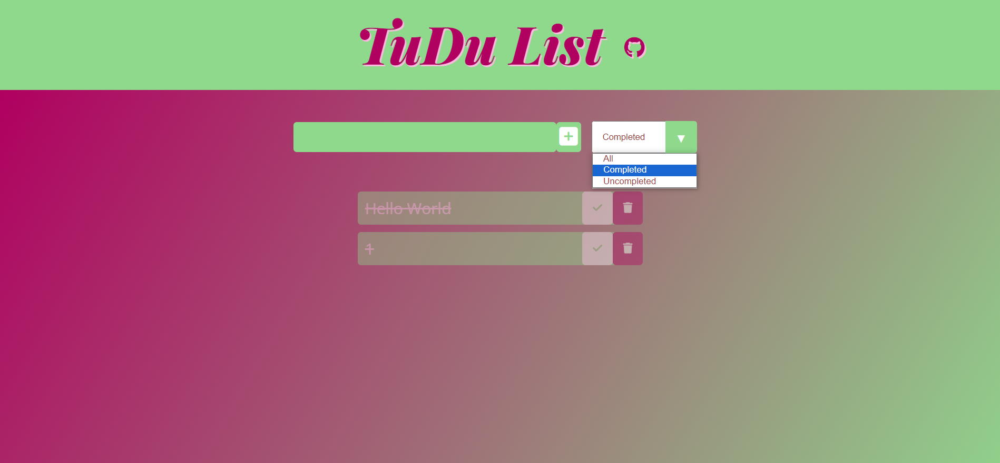

# Tudu List - Project ReadMe

Welcome to the ReadMe file for the Tudu List project! Below, you'll find information about the project, its features, and how to get started.
## Table of Contents
- [Tudu List - Project ReadMe](#tudu-list---project-readme)
  - [Table of Contents](#table-of-contents)
  - [Introduction](#introduction)
    - [Strategy](#strategy)
      - [User Stories](#user-stories)
    - [Scope:](#scope)
    - [Structure:](#structure)
    - [Features](#features)
    - [Manual](#manual)
  - [Design](#design)
    - [Color Choices:](#color-choices)
    - [Font:](#font)
    - [User Interface:](#user-interface)
    - [Languages used](#languages-used)
  - [Validation](#validation)
    - [Css](#css)
    - [Html](#html)
    - [Javascript](#javascript)
    - [Lighthouse](#lighthouse)
  - [Technicalities](#technicalities)
    - [Responsivity](#responsivity)
    - [Testing](#testing)
    - [Bugs](#bugs)
      - [Resolved Issues](#resolved-issues)
    - [Deployment](#deployment)
  - [Credits](#credits)

  

## Introduction

Tudu List is a user-friendly online to-do list application that helps streamline your tasks and stay organized. With its minimalist design and efficient task management features, Tudu List is designed to make your daily activities more manageable and stress-free.

----
### Strategy

By offering this service, users are empowered to:
- Streamline their daily routines and achieve their goals more efficiently.
- Reduce stress and anxiety associated with forgotten tasks or missed deadlines.
- Boost overall productivity by providing a clear and concise way to prioritize and track tasks.
- Promote a sense of accomplishment and motivation as users complete and review their tasks.
- Save time and mental energy by eliminating the need for complicated, feature-heavy task management tools (looking at you Slack).

#### User Stories

1. I want a straightforward online to-do list that is easy to navigate and use, so I can quickly add and manage tasks without a steep learning curve.

2. As a person who gets bored at work, I want an uncluttered and intuitive user interface on the to-do list website so that I can stay focused on my tasks without unnecessary distractions. However I also want something stylish and exciting to look at.

3. As someone who prefers minimalism, I want the to-do list to have a simple design and only essential features, ensuring I'm not overwhelmed by unnecessary options, additional task managment or clutter.
----
### Scope:

- Task Management: The primary function of the website is to allow users to add tasks. Users can input task descriptions and optionally set due dates for each task.

- Task Deletion: Users can delete tasks when they are no longer needed or have been completed.

- View Finished Tasks: Users can view a list of tasks that have been marked as completed.

- Filtering: Users can switch between different views **(There might be additional feats added in the future)**

- All Tasks: Display a list of all taks, including completed and pending ones.

- Finished Tasks: Display a list of tasks that have been marked as completed.

- Pending Tasks: Display a list of tasks that are yet to be completed.

- User-Friendly Design: The website will have a clean and intuitive user interface, emphasizing simplicity.

- Mobile Responsiveness: The website should be responsive and work well on both desktop and mobile devices.
-----

### Structure:

  
- A simple one pager

- A field for text input

- A feature to remove and add tasks through buttons

- A way to view tasks that are completed, unfinished and total tasks
  

### Features

  
1. **Task Management:** You can easily add, view, and manage your tasks.

2. **Task Prioritization:** You can mark tasks as completed or uncompleted, helping you prioritize your to-do list.

3. **Filtering:** You can filter tasks by "All," "Completed," or "Uncompleted" to focus on specific tasks.

4. **User-Friendly Interface:** The user interface is designed for simplicity and ease of use.

5. **Responsive Design:** The website is responsive and suitable for various screen sizes, including tablets and large phones.

6. **Stylish UI:** Tudu List features a visually appealing UI with a custom color scheme.

  

### Manual

  

- **Adding a Task:** Enter a task in the input field and click the "Add" button or press Enter.

- **Completing a Task:** Click the checkmark icon to mark a task as completed.

- **Deleting a Task:** Click the trash icon to delete a task.

- **Filtering Tasks:** Use the dropdown menu to filter tasks by "All," "Completed," or "Uncompleted."

  

## Design

  

### Color Choices:

  

1. **Header Background:** The header has a calming and visually pleasing background color of `#8fd98d`. This color choice creates a welcoming, fresh and exciting atmosphere.

  

2. **Input Fields and Buttons:** Input fields and buttons have a consistent background color of `#8fd98d` and white, providing a clear visual cue for interaction elements. The use of this color promotes a sense of consistency throughout the application.

  

3. **Background Color:** The background color `#b00060` is effectively used for highlights and important elements. It adds a pop of color to draw attention to specific parts of the UI, as well es generate an exciting modern feeling. It is combined with color `#8fd98d` in a linear-gradient effect to further add a unique feeling to the website.  
*This is also the reason why I decided to not include any photographs or graphics, because I wanted to keep the Site sleek and simple, yet poping.

  

4. **Text Color:** The main text color is `white` against `#b00060` backgrounds, ensuring readability and contrast. For text in the search bar, `#7b0043` is used, which complements the overall color scheme.

  

5. **Task Items:** Task items in the to-do list have a background color of `#8fd98d` to distinguish them from the rest of the interface. When a task is completed, it changes its appearance to `opacity: .4` and `text-decoration: line-through`, giving users a clear visual indication of completed tasks.

  

### Font:

  

1. **Header Font:** The header prominently features the "Playfair Display" font family for the project title. It uses an italic, bold style with a weight of 900. This font choice exudes elegance and playfulnes, making the project title stand out..

  

2. **Main Content Font:** The main content of the application utilizes the "Open Sans" font family. This sans-serif font is clean, easy to read, and works well for body text and UI elements.

  

3. **Font Size:** The font sizes have been carefully chosen to ensure readability and a balanced visual hierarchy. For example, the project title uses a larger font size (5rem on big screens, 3 rem on small screens) to make it the focal point of the header.

  

### User Interface:

  

1. **Minimalist Design:** Tudu List follows a minimalist design approach, focusing on simplicity and functionality. It avoids unnecessary embellishments and distractions, allowing users to concentrate on their tasks. The Tudu List project intentionally avoids the inclusion of a footer because it does not require any additional icons or instructions on how to use the webpage. The design's simplicity and intuitive layout make it unnecessary to clutter the interface with extraneous elements. Users can easily understand and interact with the application without the need for explicit guidance, contributing to a cleaner and more streamlined user experience.

  

2. **Responsive Design:** The website is designed to be responsive, ensuring that it adapts well to various screen sizes, including tablets and large phones. This responsiveness enhances the user experience by making the application accessible on different devices.

  

3. **Styling:** The project features custom styling to create a unique visual identity. It uses gradients, icons, and carefully chosen color combinations to provide an aesthetically pleasing user interface.

  

4. **GitHub Integration:** The inclusion of a GitHub icon and link in the header adds a touch of interactivity and connects users to the project's repository.

  

5. **UI Elements:** Buttons, form inputs, and dropdown menus, are styled to be visually appealing and user-friendly. For instance, buttons change color on hover to provide visual feedback to users.

 ### Languages used

1. **HTML5**
2. **CSS3**
3. **JavaScript** 
  

## Validation

  
### Css

  

### Html

  

### Javascript

  

### Lighthouse

  

## Technicalities  

### Responsivity

  

The responsive design covers a wide range of devices, from small screens with a width of 325px to large screens with up to 5k resolution.

  

### Testing

 

-   I tested the Todo List in different browsers: Chrome, Firefox, Safari, Edge
    
-   I confirmed the List is reacting correctly when: Submitting Form, deleting Files, Checking Files as completed, loading in appropriate categories.
    
-   I tested the Github Link to my profile.
    
-   I confirmed that the colors and fonts that are chosen are easy to read.
    

  

  

### Bugs

  

There is a circumstance when the category is toggled to „uncompleted“ and files are being checked as „completed“, they still remain in the same category. I couldn't fix the issue on time.

  

#### Resolved Issues

  
-   In the beginning the addTodo(event) wouldn't function, due to the event.preventDefault(); missing.
    
-   The bin Button wouldnt function to the the Class-list being false
    
-   Stray console.log's throughout the Js had to be removed
    
-   The event listener for the filterOption.addEventListener("change", filterTodo); had to be changed from „click“ to „change“
    
-   Throughout the JS file, appropriate Docstrings where updated to fit common JS conventions
    

  

  

  

### Deployment

-   The Project was deployed to GitHub pages. In order to deploy, follow the steps as follows:
    
    -   Log in to your GitHub Account and locate the GitHub Repository.
        
    -   In the GitHub repository, navigate to the "Settings" tab.
        
    -   In Settings, choose "Pages" from the left hand menu.
        
    -   Under "Source", select branch "Main" and select folder "(Root)".
        
    -   Click Save and the page will be automatically refreshed and display to indicate the successful deployment.
       

## Credits

  

Javascript: The overall understanding comes from the course material, the rest however came from watching over [BroCode](https://youtu.be/8dWL3wF_OMw?si=sTkXU2zOXUli1pjV) YouTube codealongs, as well as more material from his YouTube channel.

  

Of course my Mentor Brian was very helpful with cleaning up the code and completing the project.